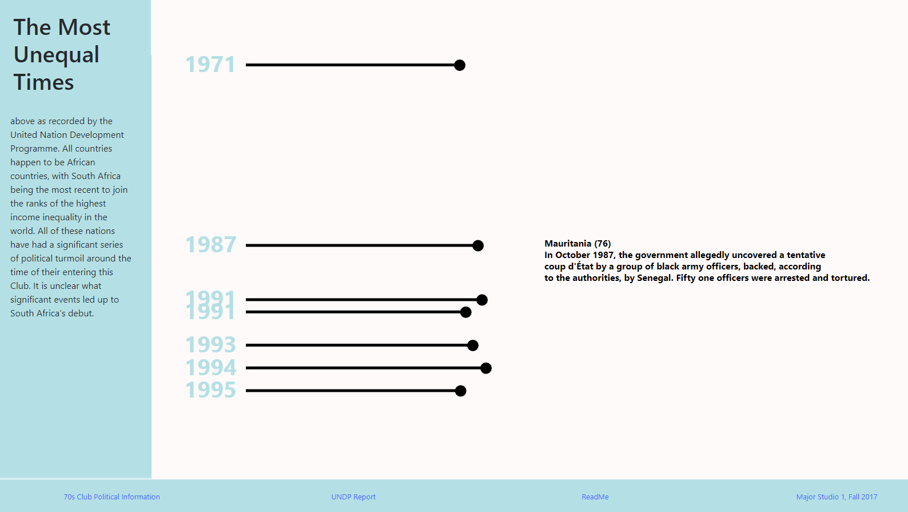

# Unequal Development

## This visualization observes countries that had a Gini coefficient of 70 or above at any period of time. Eight countries are in this very exclusive club of having been recorded with the highest income inequality in the world, and all eight happen to be African countries.

### Abstract
The years demarcated have a very strong political history in the years leading to their highest level of inequality, and all have also seen their most equal times in the years ahead except one country. South Africa had seen their most equal time in the years leading to the end of the apartheid, while being the only country to have gotten more unequal since their lowest Gini score. It is a bit mysterious as to what impactful events happened in the years leading to 2011, but looking at the UNDP Report as well as further research might help to shape an explanation that might also help find a solution to this high level of inequality.

Add info about ZA GDP compared to the rest -- to show their level of development and the cashflow.

Add more information about ZA politics leading up to the 2009 election and post election.

### Features
1. Hover over each bar to see the biggest political event that occured around or on this year that may have been the cause of the high level of inequality recorded.
2. Click bar to see more information (parsed from the UNDP report).
3. Click out to see the full graph again.

### Sources
Odusola, Ayodele, Giovanni Cornia, Haroon Bhorat, and Pedro Conceição, eds. *Income Inequality Trends in sub-Saharan Africa: Divergence, Determinants and Consequences*. Report. Regional Bureau for Africa, United Nations Development Programme. New York, NY: United Nations Development Programme, 2017. September 21, 2017. Accessed November 7, 2017. http://www.africa.undp.org/content/rba/en/home/library/reports/income-inequality-trends-in-sub-saharan-africa--divergence--dete.html.

Gradín, Carlos. *World Income Inequality Database*. Database. United Nations University World Institute for Development, Economics Research.  Helsinki, Finland: United Nations University, January 2017.

Wikipedia, The Free Encyclopedia.

### Javascript Libraries
[d3](https://d3js.org/)